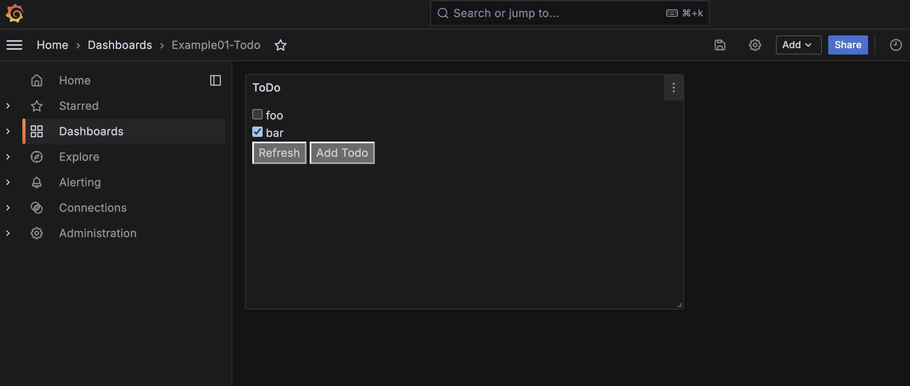

# An example about building a self hosted todo app


## Start the service

```
docker-compose up -d
```


## Create the page & widget

1. Open http://localhost/grafana
2. Login with admin/admin
3. Create a dashboard
4. Create a panel with type Text, HTML


5. Add the below html code as content

```

<script type="text/javascript" language="javascript">

// ajax post help method to communicate with backend api.
function post(url, payload) {
    var xhttp = new XMLHttpRequest();
    xhttp.open("POST", url, false);
    xhttp.setRequestHeader("Content-Type", "application/json;charset=UTF-8");
    xhttp.send(JSON.stringify(payload));
    var response = JSON.parse(xhttp.responseText);
    return response;
}

// add
function todo_add() {
    var api = "http://127.0.0.1:5000/todo/add";
    var name = prompt("Input a todo");
    if (name.trim().length == 0) {
        console.log("input is empty")
        return;
    }
    var payload = {'name': name}
    post(api, payload)
    // refresh the data from backend
    todo_refresh()
}

// check & uncheck
function todo_change(id) {
    console.log("changed id: " + id + " sliced: " + id.slice(5));
    var api = "http://127.0.0.1:5000/todo/change_status";
    var status = document.getElementById(id).checked ? 1 : 0;

    var payload = {'id': id.slice(5), 'status': status}
    var result = post(api, payload)
    console.log("update: " + result)
}

// refresh_list
function todo_refresh() {
    var api = "http://127.0.0.1:5000/todo/refresh";
    var payload = {};
    result = post(api, payload);
    console.log(result);

    // redraw items
    var newHtml = "";
    for (var i = 0; i < result.length; i++) {
        //console.log(key + ": " + result[key]); // name age
        todo = result[i];
        var todoHtml;
        if (todo['status'] == 1) {
            todoHtml = "<div> <input id='todo_" + todo['id']  + "' type='checkbox'  onchange=todo_change(this.id)  checked/> " + todo['name'] +" </div>";
        } else {
            todoHtml = "<div> <input id='todo_" + todo['id']  + "' type='checkbox'  onchange=todo_change(this.id)  > " + todo['name'] +" </div>";
        }
        newHtml += todoHtml;
    }
    document.getElementById("todo_div").innerHTML = newHtml;
}

</script>

<div id="todo_div">
Click to refresh the TODO list
</div>

<button class="sxep88s button" type="submit" onclick="todo_refresh()">Refresh</button>
<button class="button" type="submit" onclick="todo_add()">Add Todo</button>

```

Now, the widget is created with ajax method to communicate with backend, which support create and refresh.


## Build the backend api

1. Open the http://localhost/py/ and the demo-api.ipynb, to start coding. By default, the api server runs on port 9000 as configured in nginx


2. There is already a "refresh" api, lets add the "add" api. the entire code is like:
```
from flask import Flask, request
#from flask_cors import CORS
import json

app = Flask(__name__)
#CORS(app, supports_credentials=True)  # Allow Cross Domain if needed.

class TodoConf:
    # name: state pair, status 0 means not complete, 1 means completed. Corresponed to the js in grafana widget.
    todos = {
        '0': {'id': '0', 'name': 'foo', 'status': 0},
        '1': {'id': '1', 'name': 'bar', 'status': 1}
    }

# Return the latest todo list
@app.route('/apis/todo/refresh', methods=['POST', 'GET'])
def todo_refresh():
    return json.dumps([v for v in TodoConf.todos.values()])

# Add a todo item
@app.route('/apis/todo/add', methods=['POST'])
def todo_add():
    data = request.json
    print("%s" % data)  # check the posted data
    if 'name' not in data:
        return {"result": 'fail'}
    new_id = '%s' % len(TodoConf.todos)
    TodoConf.todos[new_id] = {'id': new_id, 'name': data['name'], 'status': 0}
    return json.dumps([v for v in TodoConf.todos.values()])

# Modify todo status.
@app.route('/todo/change_status', methods=['POST'])
def todo_change_status():
    data = request.json
    print("%s" % data)
    if 'id' in data and 'status' in data and data['id'] in TodoConf.todos:
        TodoConf.todos[data['id']]['status'] = data['status']
        return {"result": 'success'}
    return {"result": 'fail'}

app.run(host='0.0.0.0', port=9000)

```

3. Let's run the notebook to start the backend. Oops, there is error.


4. Install requirements
`pip install --trusted-host pypi.org --trusted-host files.pythonhosted.org -r requirements.txt `


1. Rerun the notebook.


## Debug the javascript
There is error in previous js code. So when click the "Refresh" button, it doesn't work.


```
# find this line in function todo_refresh

 var api = "http://127.0.0.1:5000/todo/refresh";

# change to this:
 var api = "/apis/todo/refresh";

```

The api will direct to the api provided by the server in notebook.

## Save and refresh the dashboard, click the "Refresh" button.




## Debug the Add function

Change the api path in function add and change status. Now, you're able to add a todo list.


## Congratulations!

You just implemented a TODO widget in your browser!!!


